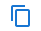
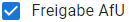

# Einstiegsseite

Die Einstiegsseite besteht aus einer Karte und einer Suchmaske.

## Karte

Zu Beginn zeigt die Karte alle Bohrungen im Kanton Solothurn an. Um in der Karte zu navigieren stehen die folgenden Werkzeuge zur Verfügung:

* Zoom In / Zoom Out 
* Ansicht gesamter Kanton 
* Zurück zur letzten Ansicht 

Das Verschieben des Kartenausschnitts geschieht durch Klicken und Ziehen im Kartenfenster, ohne dass ein Werkzeug ausgewählt werden muss.

Durch Klicken auf eine Bohrung werden die wichtigsten Informationen in einem Popup-Fenster angezeigt, ohne dass ein Werkzeug ausgewählt werden muss.

## Suchmaske

Die Suchmaske besteht aus fünf Eingabefeldern nach denen die Bohrungen bzw. Standorte durchsucht werden können:

* Gemeinde
* Grundbuchnummer(n)
* Bezeichnung
* Erstellungsdatum
* Mutationsdatum

Die gefundenen Standorte werden in einer Tabelle unterhalb der Suchmaske angezeigt. Im Kartenfenster werden nur noch die Bohrungen der gefundenen Standorte angezeigt, der Kartenausschnitt passt sich automatisch den Suchergebnissen an.

## Daten exportieren

Unter dem Menüpunkt _Daten exportieren_  können die Daten in eine Textdatei mit kommagetrennten Werten (CSV) exportiert und heruntergeladen werden. Die exportierten Felder entsprechen denen der Datenbank View _bohrung.data_export_. Die in UTF-8 codierten Daten können anschliessend, bspw. in Excel unter _Daten_ -> _Aus Text/CSV_ geladen werden.

## Standorte hinzufügen

Durch Klicken auf den Button _Neuen Standort hinzufügen_ wird ein Dialog geöffnet, in dem ein neuer Standort angelegt werden kann. Hier können die folgenden Felder befüllt werden.

* Bezeichnung (obligatorisch)
* Bemerkung
* Grundbuchnummer

Die folgenden Attribute werden automatisch gesetzt und sind im Dialog nicht sichtbar.

* Gemeinde (sobald eine Bohrung mit Geometrie vorhanden ist)
* Erstellungsdatum
* Benutzername bei Erstellung

## Standorte editieren

In der Tabelle mit gefundenen Standorten unterhalb der Suchmaske können einzelne Standorte editiert werden. Durch Klicken auf das Editieren-Icon  wird ein Dialog geöffnet, in dem der Standort editiert werden kann.

Die folgenden Felder können editiert werden.

* Bezeichnung
* Bemerkung
* Grundbuchnummer

Die folgenden Attribute werden zusätzlich angezeigt, können aber nicht editiert werden.

* Gemeinde
* Erstellungs- und Mutationsdatum
* Benutzername bei Erstellung und Mutation
* Datum der Freigabe durch das AfU
* Benutzername bei Freigabe durch das AfU

Ausserdem werden die dem Standort zugeordneten Bohrungen auf einer Karte dargestellt und in einer Tabelle angezeigt.

## Standorte löschen

In der Tabelle mit gefundenen Standorten unterhalb der Suchmaske können einzelne Standorte durch Klicken auf das Löschen-Icon  gelöscht werden.

## Bohrungen hinzufügen

Im Dialog der geöffnet ist, wenn Standorte erstellt oder editiert werden, können dem Standort zugeordnete Bohrungen erstellt werden. Bei einem neu erstellten Standort muss dieser abgespeichert werden bevor eine Bohrung hinzugefügt werden kann.
Durch Klicken auf das Hinzufügen-Icon  wird ein Dialog geöffnet, in dem eine neue Bohrung angelegt werden kann. Hier können die folgenden Felder befüllt werden.

* Bezeichnung (obligatorisch)
* Bemerkung
* Datum des Bohrbeginns
* Durchmesser des Bohrlochs
* Ablenkung der Bohrung
* Qualität der Angaben zur Bohrung
* Bemerkung zur Qualitätsangabe
* Autor der geologischen Aufnahme

Die folgenden Attribute werden automatisch gesetzt und sind im Dialog nicht sichtbar.

* Erstellungsdatum
* Benutzername bei Erstellung

## Bohrungen editieren

Im Dialog der geöffnet ist, wenn Standorte erstellt oder editiert werden, können dem Standort zugeordnete Bohrungen editiert werden.
Durch Klicken auf das Editieren-Icon  wird ein Dialog geöffnet, in dem die Bohrung editiert werden kann.

Die folgenden Felder können editiert werden.

* Bezeichnung (obligatorisch)
* Bemerkung
* Datum des Bohrbeginns
* Durchmesser des Bohrlochs
* Ablenkung der Bohrung
* Qualität der Angaben zur Bohrung
* Bemerkung zur Qualitätsangabe
* Autor der geologischen Aufnahme

Die folgenden Attribute werden automatisch gesetzt und sind im Dialog zwar sichtbar, können jedoch nicht editiert werden.

* Erstellungs- und Mutationsdatum
* Benutzername bei Erstellung und Mutation

Ausserdem werden die der Bohrung zugeordneten Bohrprofile in einer Tabelle angezeigt.

## Bohrung kopieren

Im Dialog der geöffnet ist, wenn Standorte erstellt oder editiert werden, können dem Standort zugeordnete Bohrungen durch Klicken auf das Kopieren-Icon  kopiert werden.
Es öffnet sich ein Dialog in dem die folgenden Werte von der kopierten Bohrung übernommen wurden: 

* Bezeichnung
* Bemerkung
* Datum des Bohrbeginns
* Durchmesser des Bohrlochs
* Ablenkung der Bohrung
* Qualität der Angaben zur Bohrung
* Bemerkung zur Qualitätsangabe
* Autor der geologischen Aufnahme

Vor dem Speichern der kopierten Bohrung können die Attribute geändert werden.

## Bohrung löschen

Im Dialog der geöffnet ist, wenn Standorte erstellt oder editiert werden, können dem Standort zugeordnete Bohrungen durch Klicken auf das Löschen-Icon  gelöscht werden.

## Standorte freigeben / Freigabe aufheben

Beim Bearbeiten von Standorten können Benutzer mit der Rolle **_Sachbearbeiter AfU_** und **_Administrator_** Standorte freigeben und diese auch wieder aufheben. Die Felder _AfU Freigabe erfolgt durch_ und _AfU Freigabe erfolgt am_ werden automatisch ausgefüllt und nur angezeigt wenn die Freigabe erfolgt ist.

## Zwischen Bohrungen navigieren

Wenn einem Standort mehrere Bohrungen zugeordnet sind, kann in dem geöffneten Bohrungsdialog mit den Pfeilen (vor  und zurück  zwischen den Bohrungen navigiert werden.

